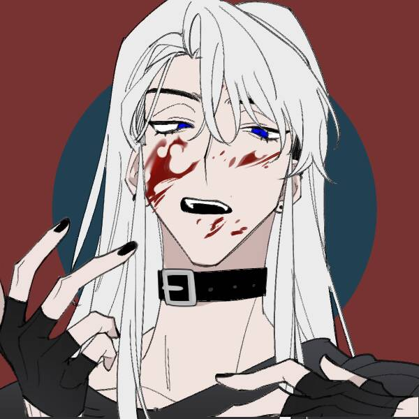
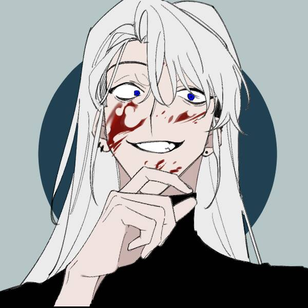

# 奥尔沃特

【这里是填写灵感的模组】

---

## 基础信息

### 【姓名】奥尔沃特

### 【性取向】

### 【性格】

【外热内冷】【笑面虎】【睚眦必报】【善恶分明】【随心所欲厌条约缚束】【喜战厌弱】

### 【ABO信息】Omega

### 【BDSM信息】

## 差异信息

### 厄瑞克斯

#### 【身高】181

#### 【体重】79

#### 【性别】男

#### 【生日】

#### 【星座】

#### 【身份】

#### 【能力】

## 立绘

# 情绪

情绪是用来帮助我们了解这个角色的基调、性格、经历的手段。我们可以通过对话、小故事、音乐、图片的方式来为我们的角色丰富TA的性格。

> 对人类的感情一窍不通，会把喜欢和杀的快感混淆，对强者有莫名的执着，对比自己强的人有着浓厚的兴趣

# 设定指导

## 武器

随身会携带数十块锋利金属片

## 人物评级

## 背景故事

奥尔沃特。男[NO.45-96877]

年龄未知，身高181，体重79kg

外热内冷，笑面虎，睚眦必报，但善恶分明，随心所欲厌条约缚束。喜战厌弱。是实验室的失败实验体之一，却是唯一一位活下来的实验体。因为实验参数的偏差，获得了“操控金属”的能力。

# 创作者信息

【名字】[叶问水]()

【人设】[叶问水]()

【能力】[叶问水]()

【立绘】[叶问水]()

