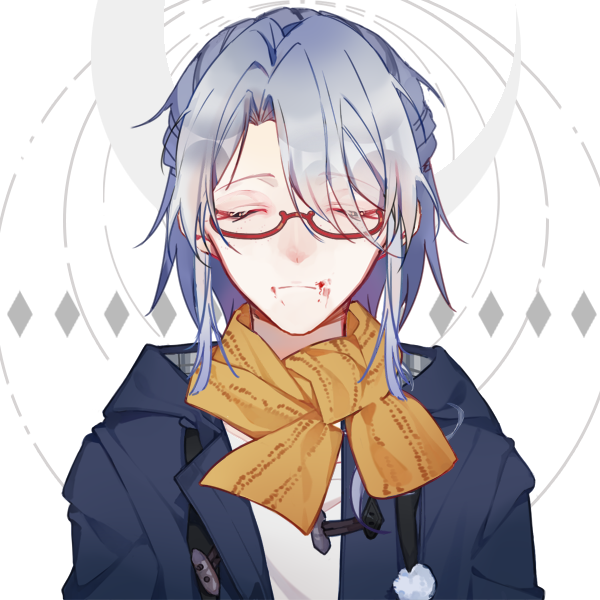

# 姜少凡

> 

---

 【自设】【保留性别】【保留名字】【保留身高】【保留体重】【保留样貌】【保留年龄】

---

【误解】【平凡】【痛苦】【龙族亲缘】【认可】【偏爱】【尊重】

---

## 基础信息

### 【姓名】姜少凡

### 【性别】男

### 【年龄】15

### 【身高】156cm

### 【体重】48kg

### 【性取向】女

### 【性格】

开朗、大方、直男、温柔、担当、责任、勇敢

### 【软肋】

直男、

### 【生日】3月26日

### 【星座】白羊座

### 【ABO信息】Alpha

### 【BDSM信息】弱S

## 差异信息

### 现实世界

#### 【身份】学生

### 厄瑞克斯

#### 【身份】引路人

#### 【武器】[德特里安的亡语](../../武器/德特里安的亡语.md)【专属】

#### 【能力】[潘多拉的眷顾](../../能力/姜少凡专属技能.md)

#### 【能力】[潘多拉的垂怜](../../能力/姜少凡专属技能.md)

#### 【能力】[潘多拉的眷顾](../../能力/姜少凡专属技能.md)

## 立绘

# 情绪

情绪是用来帮助我们了解这个角色的基调、性格、经历的手段。我们可以通过对话、小故事、音乐、图片的方式来为我们的角色丰富TA的性格。

### 对话

>“为什么？主动的人是我？低头的人是我？迁就的是我？放低姿态的人是我？道歉的人是我？”
>
>“为什么你们可以享受被别人的尊重？”
>
>“为什么你们可以被偏爱？”
>
>“为什么我不能被偏爱？为什么我不能被尊重？为什么我不能被认可？为什么我不能成为那个唯一的人？”

# 设定指导

### 设定背景

姜少凡的能力与一个无名的少女有关，少女被诅咒直至死亡，但是诅咒并没有因为她死亡而消失，而是变成了灾厄继续留存在厄瑞克斯。

#### 你会不会接受一个人的黑暗

这是一个我一直想讨论的议题，而这个议题也由我的自设，姜少凡本身去承载。没有人会无端的接受别人内心的黑暗，但是也会存在被人救赎的可能。这个少女是无辜的个体，但是有些人让她背负了悲剧的命运，而姜少凡本人能不能为了她去接受她的黑暗，我们拭目以待。

# 创作者信息

【名字】[罗易斯](http://wpa.qq.com/msgrd?v=3&uin=731984870&site=qq&menu=yes)

【人设】[罗易斯](http://wpa.qq.com/msgrd?v=3&uin=731984870&site=qq&menu=yes)

【能力】[罗易斯](http://wpa.qq.com/msgrd?v=3&uin=731984870&site=qq&menu=yes)

【立绘】[罗易斯](http://wpa.qq.com/msgrd?v=3&uin=731984870&site=qq&menu=yes)

【补充】[罗易斯](http://wpa.qq.com/msgrd?v=3&uin=731984870&site=qq&menu=yes)

