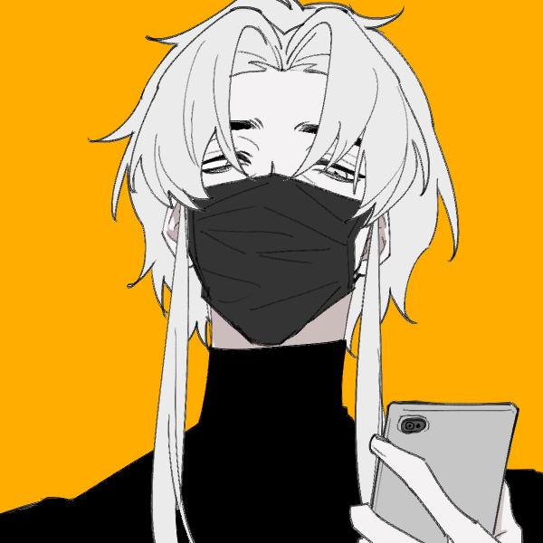
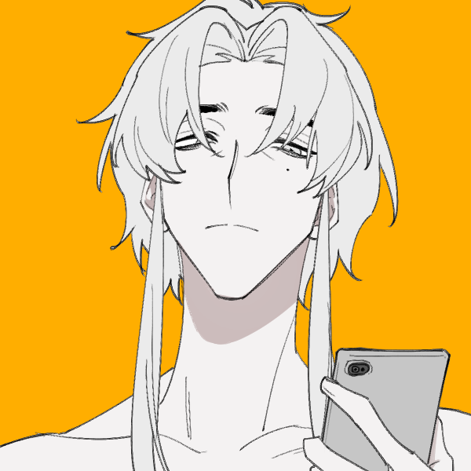

# 王少珺

【这里是填写灵感的模组】

---

## 基础信息

### 【姓名】王少珺

### 【身高】182cm

### 【性别】男

### 【生日】3月26日

### 【星座】白羊

### 【身份】

### 【体重】75kg

### 【性取向】双

### 【性格】

### 【ABO信息】Alpha

### 【BDSM信息】

## 差异信息

### 现实世界

#### 【身份】

#### 

### 厄瑞克斯

#### 【身份】

#### 【能力】

## 立绘

# 情绪

情绪是用来帮助我们了解这个角色的基调、性格、经历的手段。我们可以通过对话、小故事、音乐、图片的方式来为我们的角色丰富TA的性格。

# 设定指导

# 创作者信息

【名字】[罗易斯](http://wpa.qq.com/msgrd?v=3&uin=731984870&site=qq&menu=yes)

【人设】[罗易斯](http://wpa.qq.com/msgrd?v=3&uin=731984870&site=qq&menu=yes)

【能力】[罗易斯](http://wpa.qq.com/msgrd?v=3&uin=731984870&site=qq&menu=yes)

【立绘】[罗易斯](http://wpa.qq.com/msgrd?v=3&uin=731984870&site=qq&menu=yes)

【补充】[罗易斯](http://wpa.qq.com/msgrd?v=3&uin=1651786541&site=qq&menu=yes)

