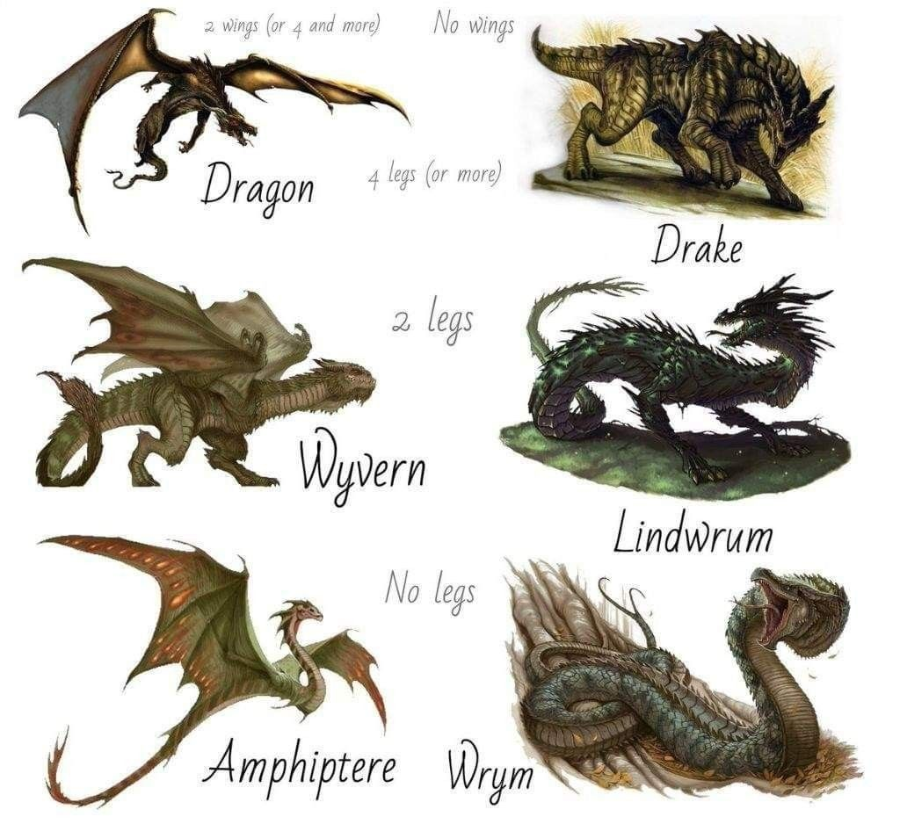
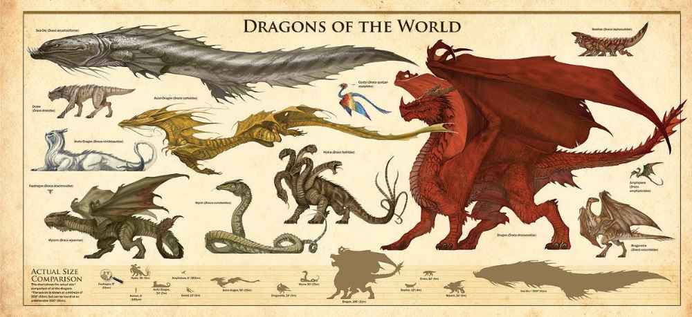
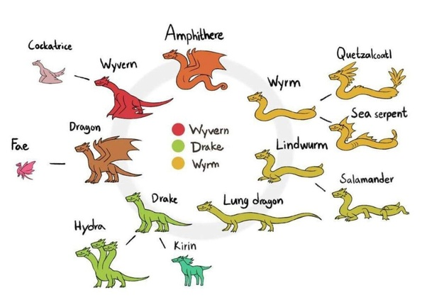

## 设定之前的序语

### 灵感来源

* 《龙族》
* 《怪物猎人：世界》
* 一些与龙族相关的影视作品

### 固有印象

* 蜥蜴多了个翅膀
* 西方龙是怪兽，东方龙是祥瑞
* 大翅膀，会喷火，像蜥蜴
* 龙有毒
* 【待补充】

### 参考图

### 龙的一些概念

#### Cockatrice

Cockatrice也被称为鸡蛇兽，是一种头如鸡，身体如双足飞龙，尾如蛇的[怪物](https://baike.baidu.com/item/怪物/6851419)，没有羽，却有鳞。据说它们是从鸡卵中孵化出的，它们的凝视可以使对手致命。它们的卵必须生于有天狼星的日子中，受精于七岁的公鸡。这一种卵很容易辨认，它们并不是普通的卵形，而是球形，没有壳，覆盖着一层厚厚的皮，这枚卵必须由蟾蜍孵化。

#### Hydra

海德拉（Hydra），是希腊神话中的九头蛇，传说它拥有九颗头，其中一颗头要是被斩断，立刻又会生出两颗头来。海德拉是西方的神话生物，在古希腊神话中出现最为频繁，但《波斯古经》、《圣经》、非洲传说、中国神话里也可以看到类似海德拉的多头怪物。如日本神话中的八岐大蛇、中国神话中的九头怪鸟鬼车、相柳。西方地狱看门的地狱犬一般被雕塑成三头形象，实际上地狱犬也是多头的，三头只是为了表达其头颅多，而不是只有三个头。似乎多头怪物在各地神话中均有出现，它们怪异的形象代表邪恶、巨大的身躯代表力量、多头则代表强悍的生命力。而更相似的是，这些怪物都是伟大英雄的背景。

#### Kirin

麒麟，中国古代的瑞兽

#### Drake

一种像龙的四足凶兽，但是没有翅膀

#### Wyrm

翻译上的解释是欧洲的龙、蛆状的龙，实际上是无爪无翼的龙。

#### Dragon

有翼四足的龙

#### Amphithere

一种有翼无爪的龙，详见维基百科[Amphiptere - Wikipedia](https://en.wikipedia.org/wiki/Amphiptere)

#### Fae

一种非常小的四爪有翼龙。

#### Lung Dragon

中国龙

#### Salamander

多足无翼

#### Lindwurm

待补充

#### Quetzalcoatl

待补充

#### SeaSerpent

称之为海龙，待补充

#### Wyvern

有爪有翼双足龙。

## 设定时的期望

设定龙族的最初的想法是，创建一个不违反直觉但是又不同于固有印象的龙族。

### 预计要加入的设定

#### 龙人

龙人作为待加入的设定，我们最主要的想法是让龙人统领龙族，在以往的作品中，龙人一般是龙的退化版本或者劣化版本；在《龙族》一书中，混血种是指龙族与人类混血诞下的婴儿。在蒂斯凡德的世界里，龙人不仅要变强，还要超越龙族，作为所有龙族的领袖。这里的思路是，所有生物的智慧形态最终演化成的样子定然是人类的样子。

#### 龙

而龙的设定估计是照搬了，再加一下音译差不多了。