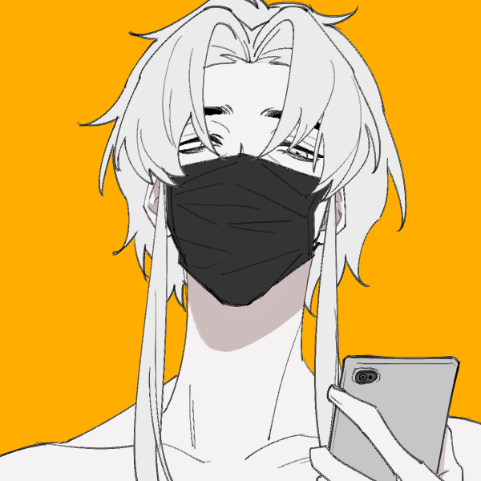

# 王少珺

# 基本设定

## 立绘

# 附属设定

## 人物的其他设定

### 王少珺的执念

你可能不知道，王少珺特别喜欢在有三角结构的地方坐着。比如阳台的角落，天台的角落，书桌的桌角。他们宿舍从来都是烟鬼宿舍，但是一直没有被抓过。直到有一天王少珺在学校教学楼顶楼的天台的角落上坐着，被路过的同学误以为是跳楼，还惊动了119，结果上去救援的时候正好逮住了这群人抽烟。

### 断裂的书桌

王少珺一直有一个习惯，就是习惯坐在有三角结构的位置（如果有），当年他们学校的桌子还是木桌子，他座位左手边是一个仰慕他的女同学，结果他同桌的桌子年久失修，他下课习惯性坐在人家桌角上，就坐塌了。而女孩子左脚骨折，就再也没爱过他了。